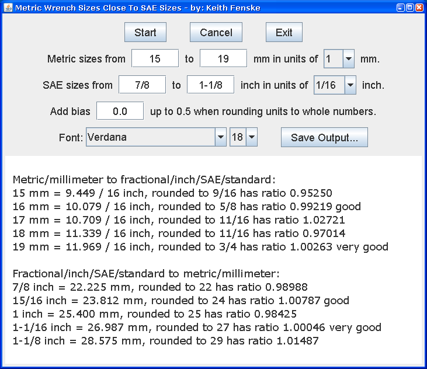

### Metric SAE Sizes (Java)

by: Keith Fenske, https://kwfenske.github.io/

MetricSaeSizes is a Java 1.4 graphical (GUI) application to calculate how close
metric bolt/nut/socket/wrench sizes are to fractional/inch/SAE/standard sizes.
The metric range is up to 250 mm (25 cm) in unit steps from 0.1 to 10 mm (1
cm), and the SAE range is up to 10 inches with steps from 1/256 to 1/2 inch.
Not surprisingly, the most interesting sizes are those of ordinary tools.

Rounding towards the nearest measurement unit ignores an obvious physical
reality: a wrench that is too small is more of a problem than a wrench that is
too big. A bias can be added so the rounding occurs from say 30% of a unit
smaller to 70% bigger, instead of 50-50. Explaining that, or any other
technical details, defeats the point of a simple chart. You would also need to
justify the chosen bias. The word "rounded" is associated with damage to bolt
heads and nuts, so maybe use the word "nearest" in public documentation.

Download the ZIP file here: https://kwfenske.github.io/metric-sae-sizes-java.zip

Released under the terms and conditions of the Apache License (version 2.0 or
later) and/or the GNU General Public License (GPL, version 2 or later).

A printer-ready chart can be found here:
https://github.com/kwfenske/socket-wrench-sizes
